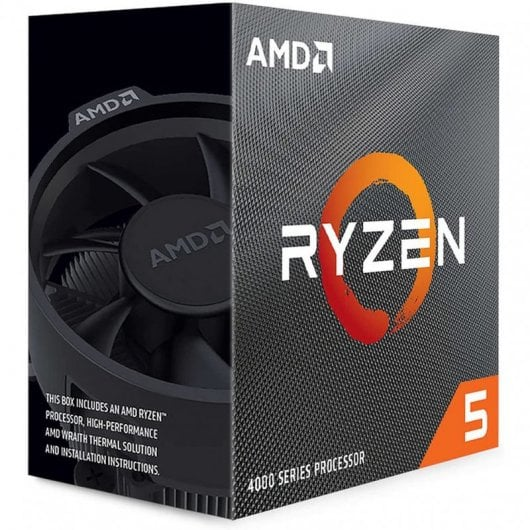

# Opción A — PC de oficina por piezas (PASO 1–7)

> Rellena cada paso usando la **plantilla**. Mantén el objetivo: **oficina**, precio ajustado y componentes razonables.

## PASO 1 — CPU con gráficos integrados

**Componente elegido:** CPU 
- **Marca y modelo:** AMD Ryzen 5 4600G 3.7/4.20GHz
- **Precio (€):**  157,99€
- **URL tienda:** https://www.pccomponentes.com/procesador-amd-ryzen-5-4600g-37-420ghz

**Ficha técnica oficial (obligatorio):**  
- URL oficial (fabricante/estándar):  https://www.amd.com/en/support/downloads/drivers.html/processors/ryzen/ryzen-4000-series/amd-ryzen-5-4600g.html#amd_support_product_spec

**Características principales (resumen):**
- (Ej.: núcleos/hilos, frecuencia, DDR4/DDR5, capacidad, formato, certificación 80+, etc.)
- Nucleos: 6
- Hilos: 12
- Frecuencia: De base 3,7 Ghz. Hasta 4,2 Ghz
- Socket: AM4
- Posibilidad de overclocking: Si

**Justificación (oficina):**
- Explica por qué es buena opción para: navegar, ofimática, vídeo ligero, consumo, ruido, etc.
Al tener graficos integrados potentes, pueden reducir el consumo energético y el calor generado. Sus 6 núcleos garantizan que la navegación con muchas pestañas y la ofimática pesada funcionen sin tirones.

**Compatibilidad (obligatorio, con enlaces):**
- Compatibilidad clave 1 (ej.: socket soportado, QVL, tipo DDR, M.2 NVMe…):  Utiliza el socket AM4, estándar para procesadores AMD.
  - Evidencia (URL):  https://www.amd.com/en/support/downloads/drivers.html/processors/ryzen/ryzen-4000-series/amd-ryzen-5-4600g.html#amd_support_product_spec   (General Specifications)
- Compatibilidad clave 2:  Soporta memoria DDR4 hasta 3200MHz.
  - Evidencia (URL):  https://www.amd.com/en/support/downloads/drivers.html/processors/ryzen/ryzen-4000-series/amd-ryzen-5-4600g.html#amd_support_product_spec   (Conectivity)

**Captura (opcional si tu profe lo exige):**
- Inserta imagen con ruta relativa desde `assets/img/`:
  

## PASO 2 — Placa base compatible

**Componente elegido:**  Placa Base
- **Marca y modelo:**  Asus Prime A520M-K
- **Precio (€):**  59,22€
- **URL tienda:**  https://www.pccomponentes.com/asus-prime-a520m-k?srsltid=AfmBOoqbgB2dLvkiUmjxkw5ILnMWUQcRDi-leU36jO9SfTZhEc-qUunV

**Ficha técnica oficial (obligatorio):**  
- URL oficial (fabricante/estándar):  https://www.asus.com/motherboards-components/motherboards/prime/prime-a520m-k/techspec/

**Características principales (resumen):**
- (Ej.: núcleos/hilos, frecuencia, DDR4/DDR5, capacidad, formato, certificación 80+, etc.)
- Socket: AM4 (compatible con procesadores AMD de serie 3000, 4000G y 5000).
- Formato: Micro-ATX
- Memoria: 2 ranuras DIMM para DDR4 (hasta 64GB y 4600MHz)
- Vídeo: Salidas HDMI 2.1 y VGA.

**Justificación (oficina):**
- Explica por qué es buena opción para: navegar, ofimática, vídeo ligero, consumo, ruido, etc.
Es una placa económica que ofrece salidas de vídeo HDMI y VGA, lo que asegura que podamos conectar cualquier monitor de oficina, aunque sea antiguo.

**Compatibilidad (obligatorio, con enlaces):**
- Compatibilidad clave 1 (ej.: socket soportado, QVL, tipo DDR, M.2 NVMe…):  El chipset A520 y el socket AM4 son 100% compatibles con la serie Ryzen 4000G
  - Evidencia (URL):  https://www.asus.com/motherboards-components/motherboards/prime/prime-a520m-k/techspec/
- Compatibilidad clave 2:  Su formato es Micro-ATX, compatible con la torre elegida.
  - Evidencia (URL):  https://www.asus.com/motherboards-components/motherboards/prime/prime-a520m-k/techspec/

**Captura (opcional si tu profe lo exige):**
- Inserta imagen con ruta relativa desde `assets/img/`:
  - ``

## PASO 3 — Memoria RAM (mínimo 8 GB)

**Componente elegido:**  RAM
- **Marca y modelo:**   Memoria RAM G.SKill Value DDR4 2133MHz PC4-17000 8GB 2x4GB CL15
- **Precio (€):**  71,78€
- **URL tienda:**  https://www.pccomponentes.com/gskill-value-ddr4-2133mhz-pc4-17000-8gb-2x4gb-cl15

**Ficha técnica oficial (obligatorio):**  
- URL oficial (fabricante/estándar):  https://www.gskill.com/specification/165/186/1535962852/F4-2133C15D-8GNT-Specification

**Características principales (resumen):**
- Capacidad: 8gb (2x4)
- Tecnologia: DDR4
- Frecuencia: 2133Mhz
- Latencia: CL15

**Justificación (oficina):**
Al instalar dos módulos de 4GB, aprovechamos la tecnología Dual Channel, lo que permite que el ordenador funcione mucho más rápido que con un solo módulo de 8GB, siendo suficiente para tareas de oficina y navegación.

**Compatibilidad (obligatorio, con enlaces):**
- Compatibilidad clave 1 (ej.: socket soportado, QVL, tipo DDR, M.2 NVMe…):  DDR4, compatible con los slots DIMM de la placa ASUS.
  - Evidencia (URL):  https://www.asus.com/motherboards-components/motherboards/prime/prime-a520m-k/techspec/  (Memoria)
- Compatibilidad clave 2:  Al funcionar a 1.2V, cumple con el estándar oficial de las placas base AM4
  - Evidencia (URL):  https://www.gskill.com/specification/165/186/1535962852/F4-2133C15D-8GNT-Specification

**Captura (opcional si tu profe lo exige):**
- Inserta imagen con ruta relativa desde `assets/img/`:
  - ``

## PASO 4 — Almacenamiento (SSD)

**Componente elegido:** SSD  
- **Marca y modelo:**  Disco Duro Intenso Premium SSD 500GB M.2 NVMe PCIe 3.0
- **Precio (€):**  95,99€
- **URL tienda:**  https://www.pccomponentes.com/intenso-premium-ssd-500gb-m2-nvme-pcie-30

**Ficha técnica oficial (obligatorio):**  
- URL oficial (fabricante/estándar): https://www.intenso.de/en/products/solid-state-drives/m-2-ssd-pcie-premium/

**Características principales (resumen):**
- Capacidad: 500gb
- Formato: M.2 2280
- Tecnologia: NVMe PCIe 3.0 x4
- Velocidades de lectura de hasta 2.100 MB/s y escritura de 1.700 MB/s.

**Justificación (oficina):**
Al no tener partes móviles, el ruido es inexistente. Permite que Windows y las aplicaciones carguen de forma casi instantánea.

**Compatibilidad (obligatorio, con enlaces):**
- Compatibilidad clave 1 (ej.: socket soportado, QVL, tipo DDR, M.2 NVMe…):  Utiliza la interfaz NVMe PCIe Gen 3.0 x4, tecnologia que soporta la ranura M.2 de la placa base Asus Prime A520M-K
  - Evidencia (URL):  https://www.asus.com/motherboards-components/motherboards/prime/prime-a520m-k/techspec/   (Storage)
- Compatibilidad clave 2:  Su tamaño es 2280(80mm de largo), lo que acepta la placa.
  - Evidencia (URL):  https://www.intenso.de/en/products/solid-state-drives/m-2-ssd-pcie-premium/

**Captura (opcional si tu profe lo exige):**
- Inserta imagen con ruta relativa desde `assets/img/`:
  - ``

## PASO 5 — Fuente (PSU)

**Componente elegido:**  PSU
- **Marca y modelo:**  Aerocool VX Plus 500W
- **Precio (€):**  58,40€
- **URL tienda:**  https://www.pccomponentes.com/fuente-alimentacion-fuente-de-alimentacion-aerocool-500w-modelo-vx-plus-500-atx-ventilador-12-cm

**Ficha técnica oficial (obligatorio):**  
- URL oficial (fabricante/estándar):  https://aerocool.io/la/product/vx-plus-500/

**Características principales (resumen):**
- Potencia: 500W
- Formato: ATX
- Ventilador silencioso de 12cm
- Raíl único de +12V

**Justificación (oficina):**
Su diseño está optimizado para ser lo más silencioso posible. Tambien incluye protecciones contra picos de tensión, lo que protege la placa y el procesador de posibles fallos eléctricos.

**Compatibilidad (obligatorio, con enlaces):**
- Compatibilidad clave 1 (ej.: socket soportado, QVL, tipo DDR, M.2 NVMe…):  Conector ATX de 24 pines para la placa base y el conector de 4+4 pines para la CPU, cumpliendo con los requisitos de la ASUS Prime A520M-K.
  - Evidencia (URL):  https://aerocool.io/la/product/vx-plus-500/
- Compatibilidad clave 2:  Tiene estándar ATX, lo que garantiza su instalación en el chasis
  - Evidencia (URL):  https://www.nox-xtreme.com/cajas/forte

**Captura (opcional si tu profe lo exige):**
- Inserta imagen con ruta relativa desde `assets/img/`:
  - ``

## PASO 6 — Chasis

**Componente elegido:**  Chasis
- **Marca y modelo:**  Torre PC Nox Forte USB 3.0
- **Precio (€):**  32,98€
- **URL tienda:**  https://www.pccomponentes.com/nox-forte-usb-30

**Ficha técnica oficial (obligatorio):**  
- URL oficial (fabricante/estándar):  https://www.nox-xtreme.com/cajas/forte

**Características principales (resumen):**
- (Ej.: núcleos/hilos, frecuencia, DDR4/DDR5, capacidad, formato, certificación 80+, etc.)
- USB 3.0 de alta velocidad
- Bandeja extra para discos duros
- Hasta 3 ventiladores
- Frontal acabado en brush
  
**Justificación (oficina):**
Buena opción para un entorno profesional por su diseño negro y simple. Es compacta y ligera, lo que facilita su colocación en escritorios con poco espacio. Tiene USB 3.0 frontal de alta velocidad para conectar periféricos y realizar copias de seguridad rápidas sin tener que acceder a la parte trasera.

**Compatibilidad (obligatorio, con enlaces):**
- Compatibilidad clave 1 (ej.: socket soportado, QVL, tipo DDR, M.2 NVMe…):  El chasis es compatible con placas base de formato Micro-ATX (Placa ASUS elegida)
  - Evidencia (URL):  https://www.nox-xtreme.com/cajas/forte
- Compatibilidad clave 2:  El chasis tiene un compartimento superior para instalar fuentes de alimentación con el estándar de tamaño ATX. Esto asegura que la fuente Aerocool pueda atornillarse de forma segura y correcta.
  - Evidencia (URL):  https://www.nox-xtreme.com/cajas/forte

**Captura (opcional si tu profe lo exige):**
- Inserta imagen con ruta relativa desde `assets/img/`:
  - ``

## PASO 7 — Presupuesto final
- Suma total de la Opción A (por piezas).
- Justifica si priorizas precio, consumo o posibilidad de ampliación.
- Incluye una mini tabla resumen.

Plantilla sugerida:
| Componente | Modelo | Precio (€) | URL tienda |
|---|---|---:|---|
| CPU | AMD Ryzen 5 4600G 3.7/4.20GHz | 157,99€ | https://www.pccomponentes.com/procesador-amd-ryzen-5-4600g-37-420ghz |
| Placa base | Asus Prime A520M-K | 59,22€ | https://www.pccomponentes.com/asus-prime-a520m-k?srsltid=AfmBOoqbgB2dLvkiUmjxkw5ILnMWUQcRDi-leU36jO9SfTZhEc-qUunV |
| RAM | Memoria RAM G.SKill Value DDR4 2133MHz PC4-17000 8GB 2x4GB CL15
 | 71,78€ | https://www.pccomponentes.com/gskill-value-ddr4-2133mhz-pc4-17000-8gb-2x4gb-cl15 |
| SSD |Disco Duro Intenso Premium SSD 500GB M.2 NVMe PCIe 3.0 | 95,99€ | https://www.pccomponentes.com/intenso-premium-ssd-500gb-m2-nvme-pcie-30 |
| PSU | Aerocool VX Plus 500W | 58,40€ | https://www.pccomponentes.com/fuente-alimentacion-fuente-de-alimentacion-aerocool-500w-modelo-vx-plus-500-atx-ventilador-12-cm |
| Chasis | Torre PC Nox Forte USB 3.0 | 32,98€ | https://www.pccomponentes.com/nox-forte-usb-30 |
| **TOTAL** |  | **476,36€** |  |
