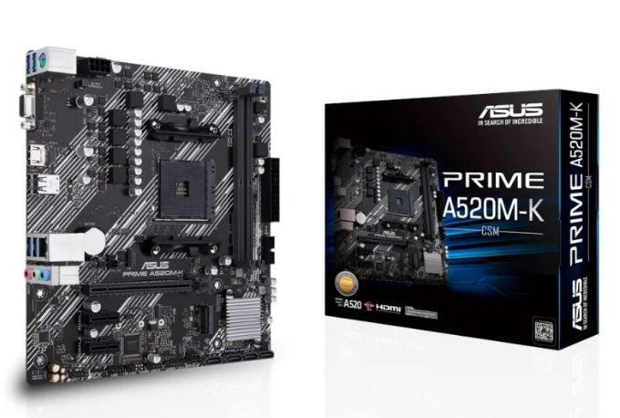
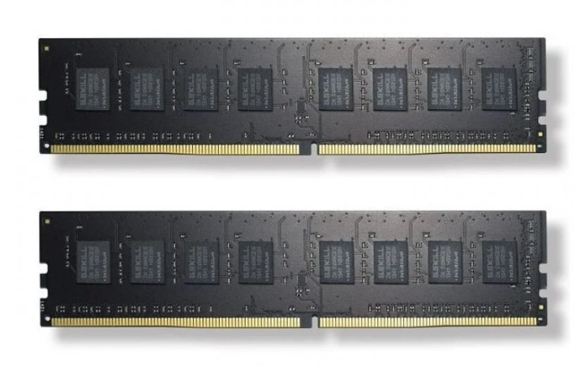
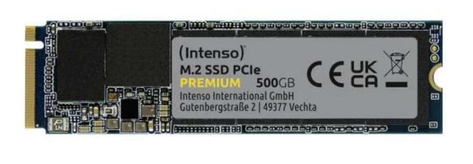
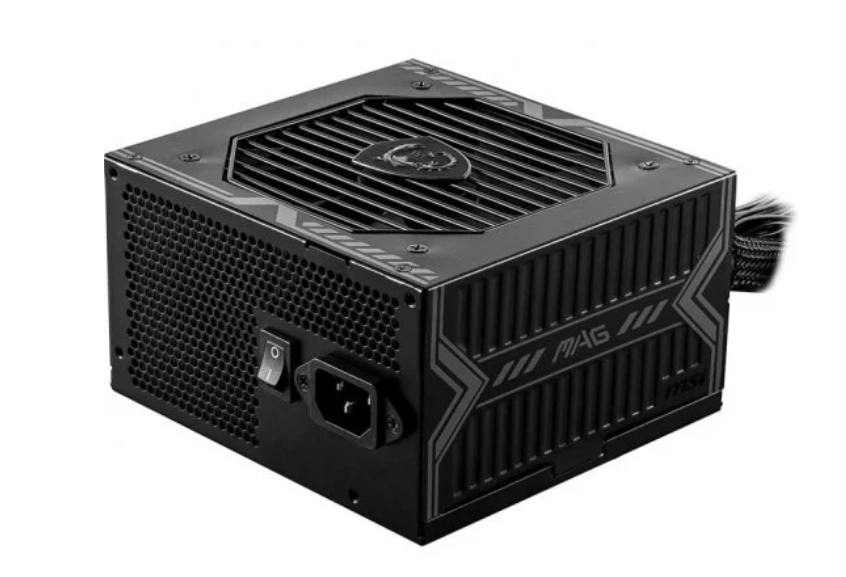
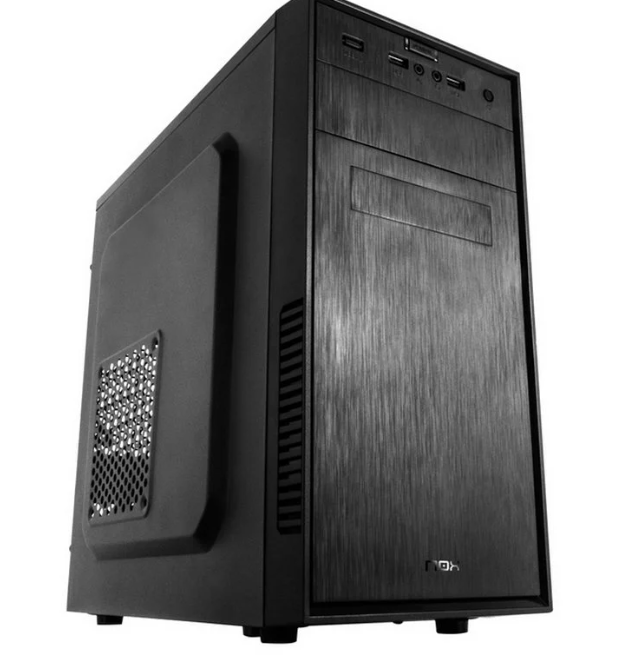

# ENTREGA ÚNICA — Reto 03 (UT3)

> Copia y pega aquí TODO lo necesario para exportar a PDF.

## 1) Portada
- **Módulo:** Fundamentos de Hardware (FHW)  
- **Unidad:** UT3  
- **Reto:** 03 — PC de oficina low-cost + Mini PC  
- **Alumno/a:** Valentin Adnriyash Andriiash  
- **Curso/Grupo:** 1º ASIR — 2º grupo
- **Fecha:** 18/02/2026  

## 2) Opción A — PC por piezas (PASO 1–7)
## PASO 1 — CPU con gráficos integrados

**Componente elegido:** CPU 
- **Marca y modelo:** AMD Ryzen 5 4600G 3.7/4.20GHz
- **Precio (€):**  157,99€
- **URL tienda:** https://www.pccomponentes.com/procesador-amd-ryzen-5-4600g-37-420ghz

**Ficha técnica oficial (obligatorio):**  
- URL oficial (fabricante/estándar):  https://www.amd.com/en/support/downloads/drivers.html/processors/ryzen/ryzen-4000-series/amd-ryzen-5-4600g.html#amd_support_product_spec

**Características principales (resumen):**
- (Ej.: núcleos/hilos, frecuencia, DDR4/DDR5, capacidad, formato, certificación 80+, etc.)
- Nucleos: 6
- Hilos: 12
- Frecuencia: De base 3,7 Ghz. Hasta 4,2 Ghz
- Socket: AM4
- Posibilidad de overclocking: Si

**Justificación (oficina):**
- Explica por qué es buena opción para: navegar, ofimática, vídeo ligero, consumo, ruido, etc.
Al tener graficos integrados potentes, pueden reducir el consumo energético y el calor generado. Sus 6 núcleos garantizan que la navegación con muchas pestañas y la ofimática pesada funcionen sin tirones.

**Compatibilidad (obligatorio, con enlaces):**
- Compatibilidad clave 1 (ej.: socket soportado, QVL, tipo DDR, M.2 NVMe…):  Utiliza el socket AM4, estándar para procesadores AMD.
  - Evidencia (URL):  https://www.amd.com/en/support/downloads/drivers.html/processors/ryzen/ryzen-4000-series/amd-ryzen-5-4600g.html#amd_support_product_spec   (General Specifications)
- Compatibilidad clave 2:  Soporta memoria DDR4 hasta 3200MHz.
  - Evidencia (URL):  https://www.amd.com/en/support/downloads/drivers.html/processors/ryzen/ryzen-4000-series/amd-ryzen-5-4600g.html#amd_support_product_spec   (Conectivity)

**Captura (opcional si tu profe lo exige):**
- Inserta imagen con ruta relativa desde `assets/img/`:
  

## PASO 2 — Placa base compatible

**Componente elegido:**  Placa Base
- **Marca y modelo:**  Asus Prime A520M-K
- **Precio (€):**  59,22€
- **URL tienda:**  https://www.pccomponentes.com/asus-prime-a520m-k?srsltid=AfmBOoqbgB2dLvkiUmjxkw5ILnMWUQcRDi-leU36jO9SfTZhEc-qUunV

**Ficha técnica oficial (obligatorio):**  
- URL oficial (fabricante/estándar):  https://www.asus.com/motherboards-components/motherboards/prime/prime-a520m-k/techspec/

**Características principales (resumen):**
- (Ej.: núcleos/hilos, frecuencia, DDR4/DDR5, capacidad, formato, certificación 80+, etc.)
- Socket: AM4 (compatible con procesadores AMD de serie 3000, 4000G y 5000).
- Formato: Micro-ATX
- Memoria: 2 ranuras DIMM para DDR4 (hasta 64GB y 4600MHz)
- Vídeo: Salidas HDMI 2.1 y VGA.

**Justificación (oficina):**
- Explica por qué es buena opción para: navegar, ofimática, vídeo ligero, consumo, ruido, etc.
Es una placa económica que ofrece salidas de vídeo HDMI y VGA, lo que asegura que podamos conectar cualquier monitor de oficina, aunque sea antiguo.

**Compatibilidad (obligatorio, con enlaces):**
- Compatibilidad clave 1 (ej.: socket soportado, QVL, tipo DDR, M.2 NVMe…):  El chipset A520 y el socket AM4 son 100% compatibles con la serie Ryzen 4000G
  - Evidencia (URL):  https://www.asus.com/motherboards-components/motherboards/prime/prime-a520m-k/techspec/
- Compatibilidad clave 2:  Su formato es Micro-ATX, compatible con la torre elegida.
  - Evidencia (URL):  https://www.asus.com/motherboards-components/motherboards/prime/prime-a520m-k/techspec/

**Captura (opcional si tu profe lo exige):**
- Inserta imagen con ruta relativa desde `assets/img/`:
  

## PASO 3 — Memoria RAM (mínimo 8 GB)

**Componente elegido:**  RAM
- **Marca y modelo:**   Memoria RAM G.SKill Value DDR4 2133MHz PC4-17000 8GB 2x4GB CL15
- **Precio (€):**  71,78€
- **URL tienda:**  https://www.pccomponentes.com/gskill-value-ddr4-2133mhz-pc4-17000-8gb-2x4gb-cl15

**Ficha técnica oficial (obligatorio):**  
- URL oficial (fabricante/estándar):  https://www.gskill.com/specification/165/186/1535962852/F4-2133C15D-8GNT-Specification

**Características principales (resumen):**
- Capacidad: 8gb (2x4)
- Tecnologia: DDR4
- Frecuencia: 2133Mhz
- Latencia: CL15

**Justificación (oficina):**
Al instalar dos módulos de 4GB, aprovechamos la tecnología Dual Channel, lo que permite que el ordenador funcione mucho más rápido que con un solo módulo de 8GB, siendo suficiente para tareas de oficina y navegación.

**Compatibilidad (obligatorio, con enlaces):**
- Compatibilidad clave 1 (ej.: socket soportado, QVL, tipo DDR, M.2 NVMe…):  DDR4, compatible con los slots DIMM de la placa ASUS.
  - Evidencia (URL):  https://www.asus.com/motherboards-components/motherboards/prime/prime-a520m-k/techspec/  (Memoria)
- Compatibilidad clave 2:  Al funcionar a 1.2V, cumple con el estándar oficial de las placas base AM4
  - Evidencia (URL):  https://www.gskill.com/specification/165/186/1535962852/F4-2133C15D-8GNT-Specification

**Captura (opcional si tu profe lo exige):**
- Inserta imagen con ruta relativa desde `assets/img/`:
  

## PASO 4 — Almacenamiento (SSD)

**Componente elegido:** SSD  
- **Marca y modelo:**  Disco Duro Intenso Premium SSD 500GB M.2 NVMe PCIe 3.0
- **Precio (€):**  95,99€
- **URL tienda:**  https://www.pccomponentes.com/intenso-premium-ssd-500gb-m2-nvme-pcie-30

**Ficha técnica oficial (obligatorio):**  
- URL oficial (fabricante/estándar): https://www.intenso.de/en/products/solid-state-drives/m-2-ssd-pcie-premium/

**Características principales (resumen):**
- Capacidad: 500gb
- Formato: M.2 2280
- Tecnologia: NVMe PCIe 3.0 x4
- Velocidades de lectura de hasta 2.100 MB/s y escritura de 1.700 MB/s.

**Justificación (oficina):**
Al no tener partes móviles, el ruido es inexistente. Permite que Windows y las aplicaciones carguen de forma casi instantánea.

**Compatibilidad (obligatorio, con enlaces):**
- Compatibilidad clave 1 (ej.: socket soportado, QVL, tipo DDR, M.2 NVMe…):  Utiliza la interfaz NVMe PCIe Gen 3.0 x4, tecnologia que soporta la ranura M.2 de la placa base Asus Prime A520M-K
  - Evidencia (URL):  https://www.asus.com/motherboards-components/motherboards/prime/prime-a520m-k/techspec/   (Storage)
- Compatibilidad clave 2:  Su tamaño es 2280(80mm de largo), lo que acepta la placa.
  - Evidencia (URL):  https://www.intenso.de/en/products/solid-state-drives/m-2-ssd-pcie-premium/

**Captura (opcional si tu profe lo exige):**
- Inserta imagen con ruta relativa desde `assets/img/`:
  

## PASO 5 — Fuente (PSU)

**Componente elegido:**  PSU
- **Marca y modelo:**  MSI MAG A650BN 650W 80 Plus Bronze
- **Precio (€):**  52,90€
- **URL tienda:**  https://www.pccomponentes.com/msi-mag-a650bn-650w-80-plus-bronze

**Ficha técnica oficial (obligatorio):**  
- URL oficial (fabricante/estándar):  https://aerocool.io/la/product/vx-plus-500/

**Características principales (resumen):**
- Potencia: 650W
- Formato: ATX
- Certificacion: 80 Plus Bronze

**Justificación (oficina):**
Tiene poco consumo eléctrico y poco calor generado. Además, sus 650W permiten futuras mejoras y sus protecciones eléctricas protegen el equipo contra subidas de tensión.

**Compatibilidad (obligatorio, con enlaces):**
- Compatibilidad clave 1 (ej.: socket soportado, QVL, tipo DDR, M.2 NVMe…):  Es una fuente de formato ATX, compatible con las dimensiones de la torre Nox Forte.
  - Evidencia (URL): https://es.msi.com/Power-Supply/MAG-A650BN/Specification
- Compatibilidad clave 2:  Tiene conector de 24 pines ATX y el de 8 pines EPS (4+4) necesarios para alimentar la placa base Asus Prime A520M-K.
  - Evidencia (URL): https://es.msi.com/Power-Supply/MAG-A650BN/Specification

**Captura (opcional si tu profe lo exige):**
- Inserta imagen con ruta relativa desde `assets/img/`:
  

## PASO 6 — Chasis

**Componente elegido:**  Chasis
- **Marca y modelo:**  Torre PC Nox Forte USB 3.0
- **Precio (€):**  32,98€
- **URL tienda:**  https://www.pccomponentes.com/nox-forte-usb-30

**Ficha técnica oficial (obligatorio):**  
- URL oficial (fabricante/estándar):  https://www.nox-xtreme.com/cajas/forte

**Características principales (resumen):**
- (Ej.: núcleos/hilos, frecuencia, DDR4/DDR5, capacidad, formato, certificación 80+, etc.)
- USB 3.0 de alta velocidad
- Bandeja extra para discos duros
- Hasta 3 ventiladores
- Frontal acabado en brush
  
**Justificación (oficina):**
Buena opción para un entorno profesional por su diseño negro y simple. Es compacta y ligera, lo que facilita su colocación en escritorios con poco espacio. Tiene USB 3.0 frontal de alta velocidad para conectar periféricos y realizar copias de seguridad rápidas sin tener que acceder a la parte trasera.

**Compatibilidad (obligatorio, con enlaces):**
- Compatibilidad clave 1 (ej.: socket soportado, QVL, tipo DDR, M.2 NVMe…):  El chasis es compatible con placas base de formato Micro-ATX (Placa ASUS elegida)
  - Evidencia (URL):  https://www.nox-xtreme.com/cajas/forte
- Compatibilidad clave 2:  El chasis tiene un compartimento superior para instalar fuentes de alimentación con el estándar de tamaño ATX. Esto asegura que la fuente Aerocool pueda atornillarse de forma segura y correcta.
  - Evidencia (URL):  https://www.nox-xtreme.com/cajas/forte

**Captura (opcional si tu profe lo exige):**
- Inserta imagen con ruta relativa desde `assets/img/`:

## PASO 7 — Presupuesto final
- Suma total de la Opción A (por piezas).
- Justifica si priorizas precio, consumo o posibilidad de ampliación.
- Incluye una mini tabla resumen.

Plantilla sugerida:
| Componente | Modelo | Precio (€) | URL tienda |
|---|---|---:|---|
| CPU | AMD Ryzen 5 4600G 3.7/4.20GHz | 157,99€ | https://www.pccomponentes.com/procesador-amd-ryzen-5-4600g-37-420ghz |
| Placa base | Asus Prime A520M-K | 59,22€ | https://www.pccomponentes.com/asus-prime-a520m-k?srsltid=AfmBOoqbgB2dLvkiUmjxkw5ILnMWUQcRDi-leU36jO9SfTZhEc-qUunV |
| RAM | Memoria RAM G.SKill Value DDR4 2133MHz PC4-17000 8GB 2x4GB CL15 | 71,78€ | https://www.pccomponentes.com/gskill-value-ddr4-2133mhz-pc4-17000-8gb-2x4gb-cl15 |
| SSD |Disco Duro Intenso Premium SSD 500GB M.2 NVMe PCIe 3.0 | 95,99€ | https://www.pccomponentes.com/intenso-premium-ssd-500gb-m2-nvme-pcie-30 |
| PSU | MSI MAG A650BN 650W 80 Plus Bronze | 52,90€ | https://www.pccomponentes.com/msi-mag-a650bn-650w-80-plus-bronze |
| Chasis | Torre PC Nox Forte USB 3.0 | 32,98€ | https://www.pccomponentes.com/nox-forte-usb-30 |
| **TOTAL** |  | **470,86€** |  |

## 3) Opción B — Mini PC (PASO 8)
**Producto elegido:**  
- **Marca y modelo exacto:**  Mini PC Beelink EQR5 AMD Ryzen 5 Pro 5650U 16GB 512GB SSD
- **Precio (€):**  419,99€
- **URL tienda:**  https://www.pccomponentes.com/mini-pc-beelink-eqr5-amd-ryzen-5-pro-5650u-16gb-512gb-ssd

**Ficha técnica oficial (obligatorio):**  
- URL oficial del fabricante: https://www.bee-link.com/es  (Ese modelo exacto no esta en la tienda oficial)

**Especificaciones:**
- CPU: AMD Ryzen 5 Pro 5650U, 6 núcleos/12 hilos, hasta 4.2 GHz
- RAM: 16 GB DDR4
- SSD/almacenamiento: SSD PCIe NVMe 512 GB
- Conectividad (Wi‑Fi/Ethernet/USB/vídeo): Wi-Fi 6 (802.11ax) doble banda (2.4/5 GHz)
- Tamaño / consumo (si aparece en ficha): 

**Ventajas (mínimo 4):**
- Al ser un buen procesador, incluye tecnologías de protección de datos a nivel de hardware.
- Su sistema de refrigeración está diseñado para ser silencioso en carga baja (oficina).
- Gracias a sus 12 hilos de ejecución, puedes navegar con muchas pestañas y programas de gestión abiertos sin tirones.
- Tener dos puertos Ethernet permite usarlo en configuraciones de red complejas o como servidor de oficina compacto.

**Contras (mínimo 4):**
- No es apto para edición de vídeo profesional o diseño 3D complejo.
- Necesita un adaptador de corriente externo (tipo portátil).
- La ranura M.2 suele ser Gen3, por lo que no aprovecharía la velocidad de un disco Gen4.
- No incluye altavoces integrados.

**¿Para qué oficina SÍ / para qué NO?**
- Sí: Cualquier puesto administrativo, contabilidad, gestión de clientes, etc.
- No: Puestos de renderizado 3D, edición 8K o estaciones de juego.

**Compatibilidad/ampliación (con enlaces):**
- ¿Se puede ampliar RAM? evidencia: Sí, tiene dos ranuras SO-DIMM que permiten subir hasta 64GB de RAM. https://www.bee-link.com/es
- ¿Se puede ampliar SSD? evidencia: Sí, cuenta con una ranura secundaria para añadir otro SSD M.2, permitiendo tener dos discos internos.

## Comparación rápida A vs B
Rellena esta tabla:

| Aspecto | Opción A (por piezas) | Opción B (Mini PC) |
|---|---|---|
| Precio total | 476,36€ | 420€ |
| Rendimiento esperado (oficina) | Muy bueno | Muy bueno |
| Ampliación (RAM/SSD) | Total (Placa base estándar) | Limitada (2x SODIMM / 2x M.2) |
| Consumo/ruido/espacio | Alto consumo / Torre grande | Bajo consumo / Ultra compacto |
| Facilidad de despliegue | Baja (requiere montaje manual) | Alta (enchufar y listo para usar) |
| Garantía/soporte | Pieza por pieza | Equipo completo |

## 4) Checklist de compatibilidad
| Compatibilidad | Evidencia (enlace) | OK |
|---|---|:--:|
| CPU ↔ Placa base (socket/chipset soportado) | https://www.asus.com/motherboards-components/motherboards/prime/prime-a520m-k/helpdesk_cpu?model2Name=PRIME-A520M-K | ✅ |
| RAM ↔ Placa base (DDR4/DDR5, velocidad soportada) | https://www.asus.com/es/motherboards-components/motherboards/prime/prime-a520m-k/techspec/ | ✅ |
| SSD ↔ Placa base (SATA o M.2; NVMe vs SATA) | https://www.asus.com/es/motherboards-components/motherboards/prime/prime-a520m-k/techspec/ | ✅ |
| PSU ↔ Placa base (24-pin ATX, EPS 8-pin si aplica) | https://www.asus.com/es/motherboards-components/motherboards/prime/prime-a520m-k/techspec/ | ✅ |
| Chasis ↔ Placa base (ATX/mATX/ITX) | https://www.nox-xtreme.com/cajas/forte | ✅  |
| Chasis ↔ PSU (ATX/SFX/TFX) | https://www.nox-xtreme.com/cajas/forte | ✅ |

## Opción B (Mini PC)
| Punto a verificar | Evidencia (enlace) | OK |
|---|---|:--:|
| RAM ampliable (sí/no, máximo) | https://www.pccomponentes.com/search/?query=Crucial+DDR4-3200+SODIMM&page=1&or-relevance | ✅ |
| SSD ampliable (sí/no, M.2/SATA) | https://www.pccomponentes.com/search/?query=Crucial+500GB+NVMe+M.2+SSD&page=1&or-relevance | ✅ |
| Conectividad (Wi‑Fi/Ethernet/USB/HDMI/DP) | https://www.majstra.com/es/producto/Mini-PC-Beelink-EQR5-5650U--SSD-de-16-GB-y-512-GB--Windows-11--doble-wifi--5G/   (info abajo) | ✅ |

## 5) Conclusión final
- ¿Qué opción elegirías para una oficina real y por qué?
Para una oficina real, elegiría la Opción B (Mini PC Beelink EQR5).
Aunque la Opción A es más personalizable, el Mini PC tiene un procesador Ryzen 5 PRO 5650U con 6 núcleos, lo que garantiza un rendimiento superior en multitarea administrativa.
Además, el ahorro de espacio en el escritorio, el bajo consumo energético y el hecho de ser un equipo Plug & Play reducen los costes de mantenimiento para la empresa.

- ¿Qué has aprendido sobre **compatibilidad**?
He aprendido que la compatibilidad no es solo de que las piezas encajen físicamente, implica asegurar que la placa base, el procesador y la RAM hablen el mismo "idioma" técnico y que sean compatibles para funcionar sin errores. También es importante verificar que el tamaño coincida para que todo quepa en la torre y que la fuente tenga certificaciones de calidad como 80 Plus Bronze para proteger el equipo. Y tambien comprendí que en equipos compactos como los Mini PC, la capacidad de mejora es más limitada.
